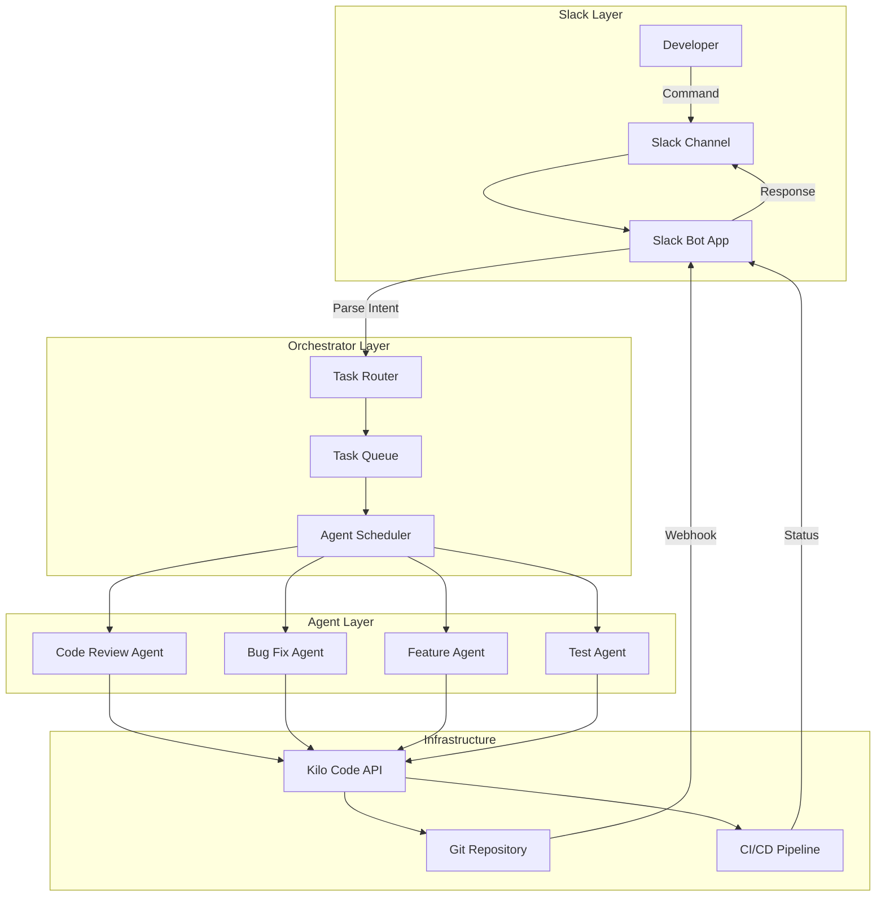
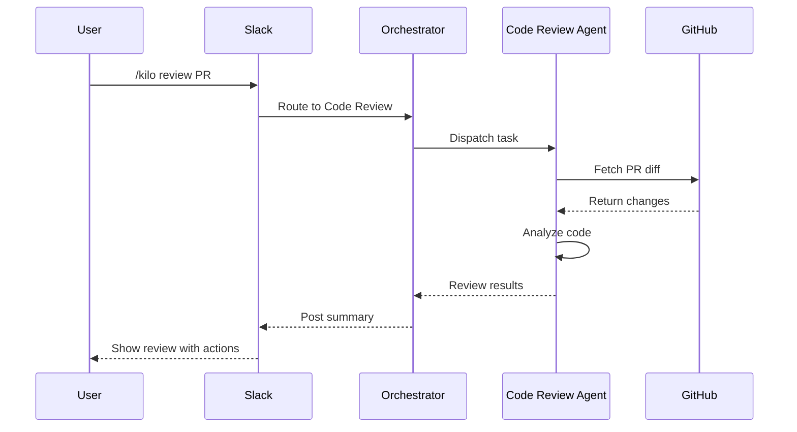
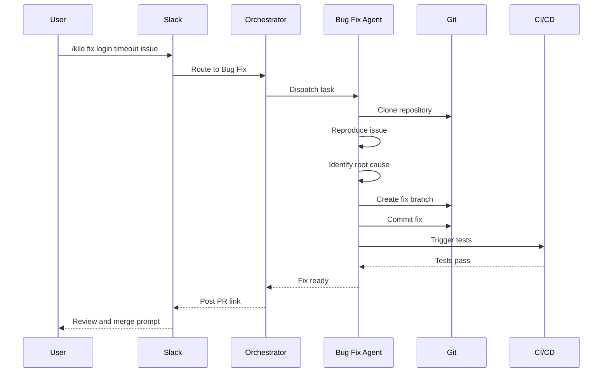
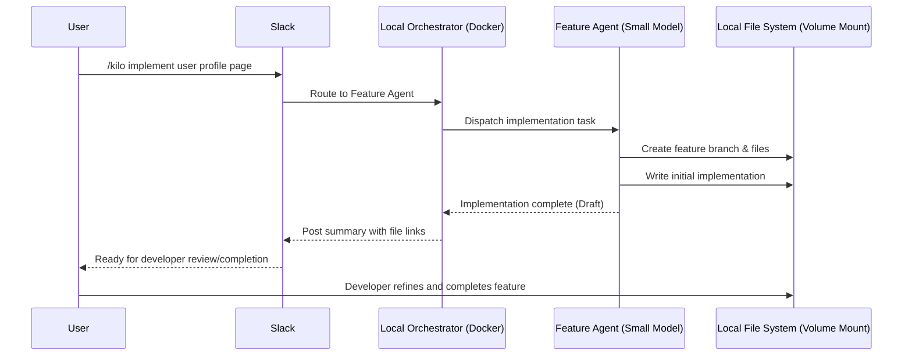
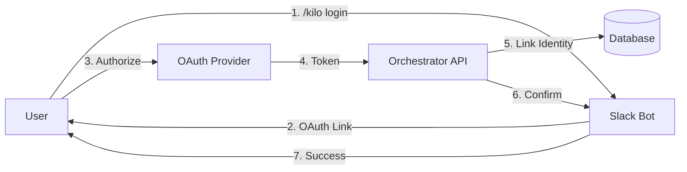
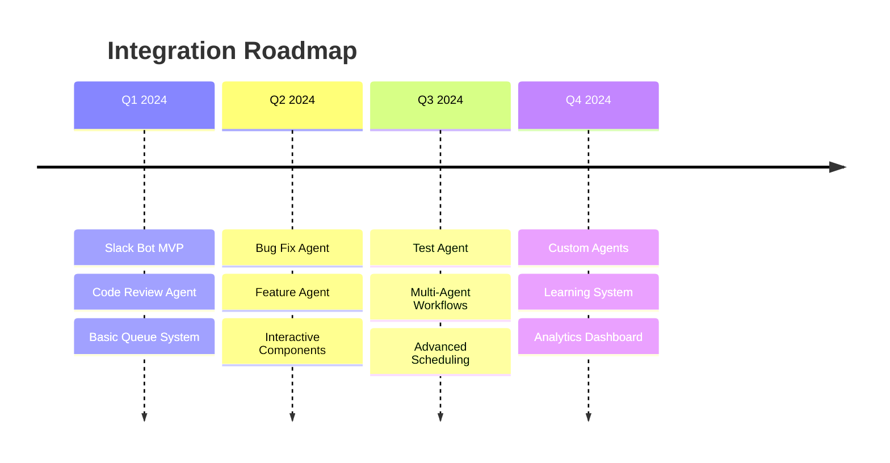

# Slack + Kilo Code Multi-Agent Orchestration

A conceptual guide for orchestrating multiple AI development agents through Slack using Kilo Code.

## Overview

This document proposes an architecture for using Slack as a command center to orchestrate multiple Kilo Code agents. Each agent specializes in different development tasks: code review, bug fixes, feature implementation, and testing.

**Primary Goal: The Local MVP Co-Pilot**
The core focus of this architecture is to enable a rapid, local-first development workflow. Slack acts as the "Commander in Chief," allowing you to kick off features, check project progress, and delegate tasks to smaller, specialized models while you remain hands-on. This hybrid approach lets AI handle the heavy lifting of scaffolding and initial implementation, while you retain full control to refine, complete, or override the work locally.

## Architecture Overview



## Proposed Architecture

### Recommended Approach: Local Docker Container + Slack Socket Mode

For a rapid, local-first MVP workflow, the most robust architecture combines:

1. **Slack Bot (Socket Mode)** - Real-time command interface without exposing local ports.
2. **Local Orchestrator Container** - A Docker container running on your machine managing agent lifecycle. This provides a clean, isolated environment without cluttering your host system with dependencies.
3. **Task Queue** - Local Redis (also containerized) for reliable task distribution.
4. **Agent Workers** - Specialized Kilo Code instances (using smaller, faster models for initial passes).
5. **Volume Mounts** - Mounting your local workspace into the container so agents can write code directly to your host file system.

This approach provides:
- Real-time interaction and progress tracking through Slack.
- Immediate local file system access for the developer to step in (via Docker volumes).
- No need for complex cloud infrastructure or ngrok tunnels during development.
- Seamless hand-off between AI agents and the human developer.
- Clean, reproducible setup across different machines without dependency hell.

### Cloud/Production Approach (Optional)

For larger teams or production environments, the orchestrator and agents can be deployed to cloud infrastructure (Docker/Kubernetes) with webhooks and CI/CD integration.

## Components

### 1. Slack Bot Application

The Slack Bot serves as the user interface for all agent interactions.

**Responsibilities:**
- Parse natural language commands
- Route requests to appropriate agents
- Stream progress updates to channels
- Handle interactive components like buttons and modals

**Example Commands:**
```
/kilo review PR #123
/kilo fix bug in auth module
/kilo implement user dashboard
/kilo test payment flow
/kilo status
```

### 2. Agent Orchestrator Service

A backend service that manages the agent ecosystem.

**Responsibilities:**
- Task routing and prioritization
- Agent lifecycle management
- Context and state management
- Result aggregation and reporting

### 3. Specialized Agents

Each agent type has specific capabilities and tools. For local MVP development, these agents often use smaller, faster models to generate initial implementations, leaving the final polish to the developer.

#### Scaffolding / MVP Agent (New)
- Generates boilerplate code and project structures
- Sets up databases and initial configurations
- Creates basic CRUD endpoints
- Focuses on speed and getting the project off the ground

#### Code Review Agent
- Analyzes pull requests
- Checks code quality and standards
- Identifies security vulnerabilities
- Suggests improvements

#### Bug Fix Agent
- Reproduces reported issues
- Identifies root causes
- Implements fixes
- Creates regression tests

#### Feature Implementation Agent
- Interprets feature requirements
- Designs implementation approach
- Writes code following project patterns
- Creates documentation

#### Test Agent
- Generates unit tests
- Creates integration tests
- Runs test suites
- Reports coverage and failures

## Workflow Examples

### Example 1: Code Review Flow



### Example 2: Bug Fix Flow



### Example 3: Multi-Agent Feature Implementation (Local Co-Pilot)



## Technical Implementation

### Slack Bot Setup

```yaml
# Slack App Manifest
display_information:
  name: Kilo Orchestrator
  description: Multi-agent development orchestration
features:
  bot_user:
    display_name: Kilo
    always_online: true
  slash_commands:
    - command: /kilo
      description: Interact with Kilo agents
      usage_hint: "[review|fix|implement|test|status]"
oauth_config:
  scopes:
    bot:
      - commands
      - chat:write
      - channels:read
      - files:write
```

### Orchestrator Service Architecture

```
orchestrator/
├── api/
│   ├── routes/
│   │   ├── slack.ts      # Slack event handlers
│   │   ├── agents.ts     # Agent management
│   │   └── tasks.ts      # Task endpoints
│   └── middleware/
│       ├── auth.ts
│       └── parser.ts
├── services/
│   ├── router.ts         # Task routing logic
│   ├── scheduler.ts      # Agent scheduling
│   └── context.ts        # Context management
├── agents/
│   ├── base.ts           # Base agent class
│   ├── code-review.ts
│   ├── bug-fix.ts
│   ├── feature.ts
│   └── test.ts
├── queue/
│   ├── producer.ts
│   └── consumer.ts
└── config/
    └── agents.yaml       # Agent configurations
```

### Agent Configuration

```yaml
# agents.yaml
agents:
  scaffold:
    mode: architect
    model: anthropic/claude-3-haiku-20240307 # Smaller, faster model for MVP
    capabilities:
      - generate_boilerplate
      - setup_database
      - create_crud
    tools:
      - write_file
      - execute_command
    max_concurrent: 1

  code-review:
    mode: architect
    capabilities:
      - analyze_code
      - check_standards
      - security_audit
    tools:
      - read_file
      - search_files
    max_concurrent: 3
    
  bug-fix:
    mode: debug
    capabilities:
      - reproduce_issue
      - identify_root_cause
      - implement_fix
    tools:
      - read_file
      - edit_file
      - execute_command
    max_concurrent: 2
    
  feature:
    mode: code
    capabilities:
      - design_solution
      - implement_feature
      - create_documentation
    tools:
      - read_file
      - write_file
      - edit_file
      - execute_command
    max_concurrent: 1
    
  test:
    mode: code
    capabilities:
      - generate_tests
      - run_tests
      - report_coverage
    tools:
      - read_file
      - write_file
      - execute_command
    max_concurrent: 2
```

## Slack Command Reference

### Global Commands

| Command | Description | Example |
|---------|-------------|---------|
| `/kilo status` | Show agent status and queue | `/kilo status` |
| `/kilo cancel [task_id]` | Cancel running task | `/kilo cancel abc123` |
| `/kilo history` | Show recent tasks | `/kilo history` |

### Code Review Commands

| Command | Description | Example |
|---------|-------------|---------|
| `/kilo review PR #<n>` | Review specific PR | `/kilo review PR #42` |
| `/kilo review branch <name>` | Review branch changes | `/kilo review branch feature/auth` |
| `/kilo review last commit` | Review latest commit | `/kilo review last commit` |

### Bug Fix Commands

| Command | Description | Example |
|---------|-------------|---------|
| `/kilo fix <description>` | Fix described bug | `/kilo fix login timeout on mobile` |
| `/kilo fix issue #<n>` | Fix GitHub issue | `/kilo fix issue #123` |
| `/kilo investigate <error>` | Investigate error | `/kilo investigate NullReference in UserService` |

### Feature Commands

| Command | Description | Example |
|---------|-------------|---------|
| `/kilo scaffold <project>` | Generate boilerplate | `/kilo scaffold express-api` |
| `/kilo implement <feature>` | Implement new feature | `/kilo implement user avatar upload` |
| `/kilo refactor <target>` | Refactor code | `/kilo refactor AuthService` |
| `/kilo migrate <target>` | Create migration | `/kilo migrate add user preferences` |

### Test Commands

| Command | Description | Example |
|---------|-------------|---------|
| `/kilo test <target>` | Generate tests for target | `/kilo test UserService` |
| `/kilo test coverage` | Check test coverage | `/kilo test coverage` |
| `/kilo test failing` | Fix failing tests | `/kilo test failing` |

## Interactive Workflows

### Button Actions

After task completion, the bot presents interactive buttons:

```
┌─────────────────────────────────────────┐
│ Code Review Complete for PR #42         │
│                                         │
│ Issues Found: 3                         │
│ Suggestions: 5                          │
│                                         │
│ [View Details] [Create Issues] [Approve]│
└─────────────────────────────────────────┘
```

### Modal Dialogs

For complex inputs, use Slack modals:

```
┌─────────────────────────────────────────┐
│ Implement New Feature                   │
├─────────────────────────────────────────┤
│ Feature Name                            │
│ ┌─────────────────────────────────────┐ │
│ │ User notification preferences       │ │
│ └─────────────────────────────────────┘ │
│                                         │
│ Description                             │
│ ┌─────────────────────────────────────┐ │
│ │ Allow users to configure how they   │ │
│ │ receive notifications...            │ │
│ └─────────────────────────────────────┘ │
│                                         │
│ Priority: [Medium ▼]                    │
│                                         │
│ [Cancel]              [Implement]       │
└─────────────────────────────────────────┘
```

## Security Considerations

### Authentication Flow



### Access Control

- **Channel-based permissions**: Restrict agent access by Slack channel
- **Role-based access**: Map Slack user groups to agent capabilities
- **Repository access**: Control which repos each agent can modify
- **Approval workflows**: Require human approval for production changes

### Best Practices

1. **Least Privilege**: Agents only access necessary resources
2. **Audit Logging**: Log all agent actions with user context
3. **Sandboxed Execution**: Run agents in isolated environments
4. **Secret Management**: Never expose credentials in Slack
5. **Rate Limiting**: Prevent abuse with per-user/per-channel limits

## Deployment Architecture

### Container-Based Deployment

```yaml
# docker-compose.yml
version: '3.8'
services:
  orchestrator:
    build: ./orchestrator
    ports:
      - "3000:3000"
    environment:
      - SLACK_BOT_TOKEN=${SLACK_BOT_TOKEN}
      - SLACK_SIGNING_SECRET=${SLACK_SIGNING_SECRET}
      - REDIS_URL=redis://redis:6379
    depends_on:
      - redis
      
  redis:
    image: redis:7-alpine
    volumes:
      - redis_data:/data
      
  agent-worker:
    build: ./agent-worker
    deploy:
      replicas: 4
    environment:
      - REDIS_URL=redis://redis:6379
      - KILO_API_KEY=${KILO_API_KEY}
    volumes:
      - ./workspaces:/workspaces
    depends_on:
      - redis
      
volumes:
  redis_data:
```

### Kubernetes Deployment

```yaml
# agent-deployment.yaml
apiVersion: apps/v1
kind: Deployment
metadata:
  name: kilo-agents
spec:
  replicas: 4
  selector:
    matchLabels:
      app: kilo-agent
  template:
    metadata:
      labels:
        app: kilo-agent
    spec:
      containers:
      - name: agent
        image: kilo-agent:latest
        resources:
          requests:
            memory: "2Gi"
            cpu: "1"
          limits:
            memory: "4Gi"
            cpu: "2"
        envFrom:
        - secretRef:
            name: kilo-secrets
```

## Monitoring and Observability

### Metrics to Track

- **Task throughput**: Tasks completed per hour
- **Agent utilization**: Active agents vs. idle
- **Queue depth**: Pending tasks
- **Error rates**: Failed tasks by type
- **Latency**: Time from command to completion

### Dashboard Example

```
┌────────────────────────────────────────────────────────────┐
│ Kilo Agent Dashboard                          Last 24 Hours│
├────────────────────────────────────────────────────────────┤
│ Tasks Completed: 147    Success Rate: 94.5%               │
│ Avg Latency: 4m 32s     Queue Depth: 3                     │
├────────────────────────────────────────────────────────────┤
│ Agent Utilization                                          │
│ Code Review  ████████████████░░░░  80%                    │
│ Bug Fix      ████████████████████  100%                   │
│ Feature      ████████░░░░░░░░░░░░  40%                    │
│ Test         ██████████████░░░░░░  65%                    │
├────────────────────────────────────────────────────────────┤
│ Recent Activity                                            │
│ 10:42  Code Review  PR #156      @sarah    ✓ Complete     │
│ 10:38  Bug Fix     Auth timeout  @mike     ⟳ In Progress  │
│ 10:35  Test        UserService   @sarah    ✓ Complete     │
│ 10:30  Feature     Dashboard     @alex     ⏸ Pending      │
└────────────────────────────────────────────────────────────┘
```

## Future Enhancements

### Planned Features

1. **Agent Collaboration**: Multiple agents working together on complex tasks
2. **Learning from Feedback**: Agents improve based on user corrections
3. **Custom Agents**: Define project-specific agent types
4. **Scheduled Tasks**: Periodic code reviews and maintenance
5. **Multi-Repo Support**: Orchestrate across multiple repositories

### Integration Roadmap



## Cost Estimation

This section provides estimated costs for running the Slack + Kilo Code multi-agent orchestration system.

### Infrastructure Costs

| Component | Provider Options | Monthly Cost (Est.) |
|-----------|------------------|---------------------|
| **Orchestrator Service** | Railway, Fly.io, Render | $5-20 |
| **Agent Workers (4 replicas)** | Railway, Fly.io, Kubernetes | $20-80 |
| **Redis Queue** | Upstash, Redis Cloud, Railway | $0-15 |
| **PostgreSQL (state)** | Railway, Neon, Supabase | $0-10 |
| **Slack App** | Slack (free tier) | $0 |

**Infrastructure Total: $25-125/month**

### AI/API Costs

| Service | Usage Pattern | Monthly Cost (Est.) |
|---------|---------------|---------------------|
| **Kilo Code API** | ~100 tasks/month | $50-200 |
| **Kilo Code API** | ~500 tasks/month | $200-500 |
| **GitHub API** | Standard usage | $0 (free tier) |
| **OpenAI/Claude** (if used directly) | Varies by model | $20-100 |

**AI/API Total: $50-600/month** (varies heavily by usage)

### Cost by Scale

#### Small Team (5-10 developers)
```
Infrastructure:     $25-50/month
AI/API (50 tasks):  $50-100/month
─────────────────────────────────
Total:              $75-150/month
```

#### Medium Team (10-25 developers)
```
Infrastructure:     $50-100/month
AI/API (200 tasks): $150-300/month
─────────────────────────────────
Total:              $200-400/month
```

#### Large Team (25+ developers)
```
Infrastructure:     $100-200/month
AI/API (500+ tasks): $300-600/month
─────────────────────────────────
Total:              $400-800/month
```

### Cost Optimization Tips

1. **Use spot/preemptible instances** for agent workers (50-70% savings)
2. **Scale workers based on queue depth** (auto-scale down during low usage)
3. **Cache frequent operations** (reduce API calls)
4. **Use free tiers** where possible:
   - Slack: Free tier supports 10 apps
   - Upstash Redis: 10,000 requests/day free
   - Railway: $5 free credit/month
   - GitHub API: 5,000 requests/hour free

### ROI Consideration

If the system saves each developer **30 minutes per week**:
- 10 developers × 30 min = 5 hours/week saved
- At $75/hour avg developer cost = $375/week saved
- Monthly savings: **~$1,500**

**Break-even point: ~1-2 months** for a small team setup.

---

## Getting Started (Local MVP Workflow)

### Prerequisites

- Slack workspace with admin access
- Kilo Code API access
- Docker and Docker Compose installed
- Git repository access

### Quick Start

1. **Create Slack App (Socket Mode)**
   - Go to api.slack.com/apps and create a new app.
   - Enable **Socket Mode** (this prevents needing to expose local ports).
   - Generate an App-Level Token (`xapp-...`) with `connections:write` scope.
   - Install to your workspace and note the Bot Token (`xoxb-...`).

2. **Run Local Orchestrator Container**
   ```bash
   git clone https://github.com/your-org/kilo-orchestrator-local
   cd kilo-orchestrator-local
   cp .env.example .env
   # Add your SLACK_APP_TOKEN and SLACK_BOT_TOKEN
   
   # Start the orchestrator and redis via docker-compose
   # This mounts your local workspace into the container
   docker-compose up -d
   ```

3. **Configure Agents for MVP**
   - Edit `agents.yaml` to use smaller, faster models (e.g., Claude Haiku or Gemini Flash) for rapid prototyping.
   - Ensure the `docker-compose.yml` volume mount points to your active development directory.

4. **Test in Slack**
   ```
   /kilo scaffold new-express-api
   ```
   - Watch the agent create files locally via the volume mount.
   - Step in and modify the code as needed.

## Conclusion

This architecture provides a scalable, secure, and user-friendly way to orchestrate multiple Kilo Code agents through Slack. By focusing on a local-first, "Co-Pilot" workflow, developers can rapidly prototype ideas, delegate boilerplate tasks to smaller AI models, and maintain full control over the final implementation. As the project grows, the architecture can seamlessly transition to a cloud-deployed, multi-agent system.
